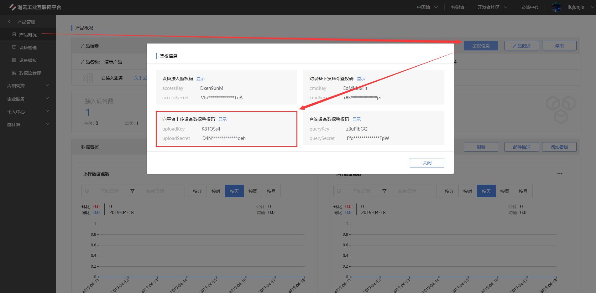

# 离线上传客户端程序用户手册v1.0.0

## 概述

本程序用于上传离线数据到瀚云工业互联网平台，目前支持单个文件或者目录的形式上传。

如果数据量较大，为了多线程快速上传，瀚云平台推荐使用目录（多个文件）的方式进行数据上传，不推荐使用单个大文件的方式进行数据上传。

## 前提条件

使用本程序前，请先确保满足如下前提条件。

### 1、文件格式

数据必须以csv文件的形式存储，格式规则如下：

`deviceKey,time,stream,type,data`

- deviceKey：设备Key
- time：时间戳
- stream：数据流名称
- type：数据类型
- data：数据

其中type（数据类型）包括

| type（数据类型） | description（描述）           |
| ---------------- | ----------------------------- |
| 1                | json                          |
| 2                | int                           |
| 3                | string                        |
| 4                | double                        |
| 5                | bin（base64编码的二进制数据） |

本程序会对type与data是否匹配做校验，校验不通过则会忽略该条数据，成功则添加至缓冲区等待上传。

[文件样例](test.csv)

### 2、开通服务

需在瀚云平台申请开通离线上传服务，待审核通过后，方可使用本服务。

申请开通服务时，需填写月流量，单位是GB，超出月流量时平台将拒绝上传。

本服务有如下限制：

- 所有数据必须属于同一个产品（可以属于该产品的不同设备）
- 单个文件最大2GB

### 3、程序运行环境

本程序依赖JDK1.8，请先确保已安装。

## 开始使用


### 1、下载程序

从[瀚云GitHub](http://git.hyun.in/platform_service/offline-upload-client/src/master/src/main/tar/offline-upload-client-1.0.0.tar.gz)下载tar程序包，并解压。程序的目录结构如下：

```
├── offline-upload-client
│   └── bin
│       ├── startup.bat              （Windows启动脚本）
│       ├── startup.sh               （linux启动脚本）
│   └── conf
│       ├── application.properties   （程序配置文件）
│       ├── banner.txt               （banner配置文件）
│       ├── logback.xml              （logback配置文件）
│   └── lib                          （运行类库）
│   └── logs                         （日志目录）
│       ├── app.log
```

### 2、修改配置

应用参数修改

```
vi conf/application.properties
```

```
# 需上传的文件目录路径或文件路径，linux例子：/upload/test  windows例子：D:\\upload\\test
upload.client.path = /upload/test
# 数据所属的产品key
upload.client.product-key = WL4odQnH
# UploadKey
upload.client.upload-key = a0DrJ5GY
# UploadSecret
upload.client.upload-secret = VcpSXwWuj9lfPOLg
# 单次向服务端发送的数量，最大2000
upload.client.batch-size = 500
# 并行数，单个文件只能由单个线程做处理，建议为目录下文件数量且小等于cpu核心数目的2倍
upload.client.parallel = 3
# 失败重试数，达到最大重试次数后程序将自动退出
upload.client.retrying-time = 3
# 获取token的url链接
upload.client.token-url = https://offline-upload.hanclouds.com/api/offline/upload/getPermission
# 上传的url链接
upload.client.upload-url = https://offline-upload.hanclouds.com/api/offline/upload/save
# 上传完成的url链接
upload.client.finish-url = https://offline-upload.hanclouds.com/api/offline/upload/taskFinish
```

配置参数中必须修改的为`upload.client.path`，`upload.client.product-key`，`upload.client.upload-key`，`upload.client.upload-secret`。其中`upload.client.product-key`必须对应设备所属的productKey，`upload.client.upload-key`及`upload.client.upload-secret`可登陆[平台](https://www.hanclouds.com/)查询，如下图所示：



`upload.client.token-url`,`upload.client.upload-url`,`upload.client.finish-url`分别表示服务端暴露的几个接口路径（一般不需要做修改），其他配置参数可根据实际要求参考注释说明自行修改。

### 3、启动程序

linux:

`./bin/startup.sh`

Windows:

`./bin/startup.bat`

程序启动后将会在 `/log`目录下生成日志，默认配置是单个日志最大20MB，保留30天

### 4、断点续传

1.程序在启动后将会向服务端申请临时token，如果获取成功则会记录到`upload.client.path`路径下的`.token`文件中，一个`.token`文件对应的就是一次文件上传任务。如果客户端在完成本地上传任务之前发生中断，就会读取该`.token`文件中的数据进行续传。`.token`文件将会在一次任务完成后自动删除。

2.客户端在获取到token后，会开始数据上传并同样在`upload.client.path`路径下生成`.offset`文件，需要注意的是，每个`.offset`文件都对应一个文件的成功发送数据的行号记录，如果该文件被删除，那么所对应的文件将会从头开始上传。需要注意的是`.offset`文件即使在上传任务完成后也不会自动删除。

3.对于offset的记录，客户端会在每个批次的数据发送成功并获取到服务端的响应后记录到本地的`.offset`文件中，但是如果客户端由于意外的中止（强行关闭），服务端可能会接收到重复数据，最大的重复数据数为：`中断次数 * upload.client.batch-size`

### 5、日志
如果程序出错，可以查阅日志文件：logs/app.log

### FAQ

1、上传成功了，但在瀚云门户上并没有看到数据？

有可能没通过服务端的校验，服务端校验过程如下：

- 校验设备是否属于对应的产品，如果不属于将丢弃数据。

- 校验数据流是否已存在，如果存在，则数据类型必须相同，例如原来是int，新的数据也必须是int，如果数据类型不相同则丢弃数据。
- 对于json格式的数据，则会校验jsonSchema，json数据的字段可以增加，不能减少和修改。

2、上传成功了，但没有立刻在瀚云门户上看到数据，而是过了一会儿才出现？

如果数据量较大，会有一定的入库延迟。
